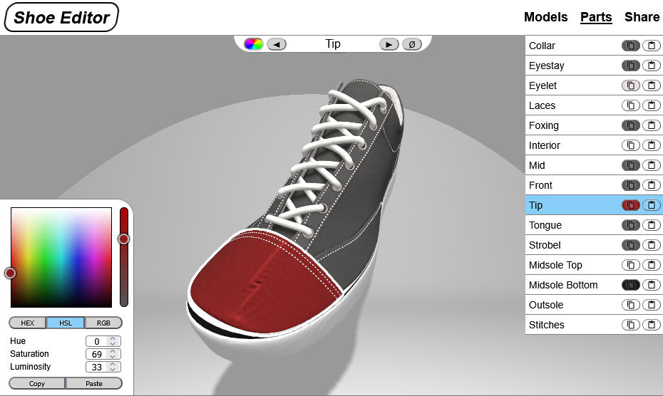
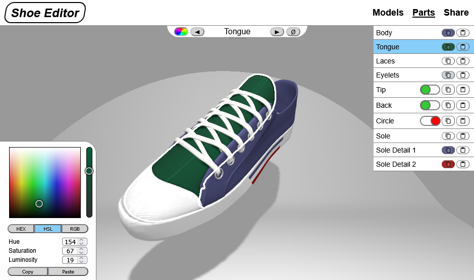

# [Live website](https://dgloliveira.github.io/Shoe-Editor/)

# Summary

This is a simple proof of concept webapp for personalizing and sharing 3D shoe models. It currently allows for changing the colors of individual parts of a shoe, and depending on the model, remove/add extra features. It is fully reactive, and can be shared by simply copying the current link after editing, or making use of the available social media quick share buttons. Due to limitations of mobile browsers, a custom

# About the models

These models were based on real life counterparts and personally modeled in Blender. They are made in such a way that allows for ease of use with json data files, listing its separate part names and default values. The webapp makes use of three.js and its react adapted library, @react-three/fiber, to render the models, along with other related libraries that provide extra components and facilitate the project development. 

As it stands, there are currently only two models available, and no future plans to expand its rooster. The brands from the shoes by wich the models are based on were omitted, and any potential identifier removed. I make no claim to the originality of the model, nor its use for commercial purposes. The models were picked due to their difference in category, and are named as such.

# Known Issues

There is currently a known issue causing infinite rerendering of the model when a part of it is selected, while it does not break the app, it does create issues in older mobile devices due to exerting the gpu, leading to the device heating up. This is caused due to ongoing changes in the react library that are causing issues with current @react-three/postprocessing library code, and is expected to be solved in future updates.
